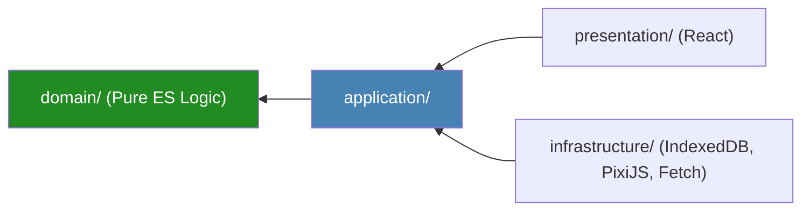

# Production-Grade Implementation Plan Package

> [!NOTE]
> ### HISTORICAL PLANNING SPECIFICATION
> **THIS DOCUMENT IS HISTORICAL / ARCHIVAL.**
> **SUPERSEDED BY**: [docs/architecture_index.md](architecture_index.md) (Level 2 SSoT), [docs/port_contracts.md](port_contracts.md) (Level 5 SSoT), and [docs/task_registry_lock.md](task_registry_lock.md) (Level 6 SSoT).
> **FOR ARCHIVAL PLANNING REFERENCE PURPOSES ONLY.**

**Project**: Browser-Only Geopolitical Strategy Simulation MVP (El Alamein & Ras El Hekma)  
**Governing Documents**: [Constitution](constitution.md) | [Architecture Package](architecture_package.md) | [Stress Test Audit](architecture_stress_test_audit.md)  
**Phase Gate**: Implementation Planning Phase (Zero Production Code Mode)  
**Review Board**: Independent Principal Architecture Planning Board

---

## 1. Technical Implementation Roadmap (`plan.md`)

```
Phase 0: Project Setup & Automated Fitness Functions (CI Gates)
   ├── Initialize Vite + TypeScript Project & Strict Lint Rules
   ├── Implement AST Architecture Fitness Functions (Ban Math.random/Date.now in domain)
   └── Configure Hexagonal Boundary Import Rules

Phase 1: Pure Domain Layer Implementation (Zero Dependencies)
   ├── Value Objects (RegionId, FactionId, TurnSeed, TurnNumber, FixedPointResourcePool)
   ├── Entities (Region, TurnAction)
   ├── Aggregates (GameState, Faction)
   └── Domain Services (TurnEngine, Deterministic PRNG)

Phase 2: Application Layer & Port Specifications
   ├── Application DTOs (Commands, ViewModels, Snapshots)
   ├── Ports (IGameApplicationService, IPersistencePort, ILLMProviderPort, IRendererPort)
   └── Use Cases (ProcessTurnUseCase, InitializeGameUseCase)

Phase 3: Infrastructure Adapters & Local Storage
   ├── IndexedDBStorageAdapter (Atomic Write + Memory Fallback)
   ├── FetchCustomLLMAdapter (3s Circuit Breaker + TurnNumber Verification)
   ├── MockLLMAdapter (Offline Template Narratives)
   └── PixiJSCanvasAdapter (Visual Map Adapter for El Alamein & Ras El Hekma)

Phase 4: Presentation Layer & Application Composition Root
   ├── React UI Views & State Presenters
   ├── Composition Root Wiring (main.ts)
   └── Verification & Determinism Integration Test Suite
```

---

## 2. Technical Research Specification (`research.md`)

| Technical Item | Resolution Status | Technical Solution / Standard |
| :--- | :--- | :--- |
| **Cross-Browser PRNG** | Resolved | Mulberry32 32-bit integer PRNG algorithm for guaranteed cross-browser parity. |
| **Integer Resource Math** | Resolved (ADR-004) | Fixed-point integer arithmetic (1.00 unit = 100 base integer units). |
| **Atomic Browser Storage** | Resolved (ADR-005) | Write snapshot to `.tmp` key in IndexedDB before swapping active pointer. |
| **PixiJS Canvas Resizing** | Resolved | `ResizeObserver` on container DOM element triggering `renderer.resize()`. |
| **Stale LLM Responses** | Resolved (M-02) | Immutable `TurnNumber` tag attached to `LLMNarrative`; discard if `tag < currentTurn`. |

---

## 3. Data Model Specification (`data-model.md`)

### Aggregates & Invariants

#### 1. `GameState` (Aggregate Root)
- **Attributes**: `sessionId: string`, `currentTurn: TurnNumber`, `seed: TurnSeed`, `factions: Map<FactionId, Faction>`, `regions: Map<RegionId, Region>`, `isGameOver: boolean`
- **Invariants**:
  - `regions` must contain exactly two regions (`EL_ALAMEIN`, `RAS_EL_HEKMA`).
  - `factions` must contain exactly two playable factions (`FACTION_ALPHA`, `FACTION_BETA`).
  - Total control of regions must always sum to 100%.

#### 2. `Faction` (Aggregate Root / Entity)
- **Attributes**: `factionId: FactionId`, `resources: FixedPointResourcePool`, `stabilityIndex: number` (0 to 100 integer)

### Entities & Value Objects

#### 1. `Region` (Entity)
- **Attributes**: `regionId: RegionId`, `controllingFactionId: FactionId`, `infrastructureLevel: number`, `defenseLevel: number`

#### 2. `TurnNumber` (Value Object - Immutable)
- **Attributes**: `value: number` (Integer >= 1)

#### 3. `TurnSeed` (Value Object - Immutable)
- **Attributes**: `seedValue: number` (32-bit Unsigned Integer)

#### 4. `FixedPointResourcePool` (Value Object - Immutable - ADR-004)
- **Attributes**: `capitalBaseUnits: bigint`, `influenceBaseUnits: bigint` (1 Display Unit = 100 Base Units)
- **Operations**: `add()`, `subtract()`, `multiplyFactor()` returning new `FixedPointResourcePool` instances.

#### 5. `LLMNarrative` (Value Object - Immutable - M-02)
- **Attributes**: `turnNumber: TurnNumber`, `narrativeText: string`, `isFallback: boolean`

---

## 4. Port Contracts Specification (`contracts/`)

### `IGameApplicationService` Contract
```typescript
interface IGameApplicationService {
  initializeNewGame(command: InitializeGameCommand): Promise<CommandResultDTO>;
  processTurn(command: ProcessTurnCommand): Promise<CommandResultDTO>;
  loadSession(command: LoadSessionCommand): Promise<CommandResultDTO>;
}
```

### `IPersistencePort` Contract (ADR-005)
```typescript
interface IPersistencePort {
  saveState(sessionId: string, snapshot: GameStateSnapshotDTO): Promise<void>;
  loadState(sessionId: string): Promise<GameStateSnapshotDTO | null>;
  isStorageAvailable(): Promise<boolean>;
}
```

### `ILLMProviderPort` Contract (M-02)
```typescript
interface ILLMProviderPort {
  fetchNarrative(prompt: LLMPromptDTO, turnNumber: TurnNumber): Promise<LLMNarrative>;
}
```

### `IRendererPort` Contract
```typescript
interface IRendererPort {
  initializeStage(containerElement: HTMLElement): void;
  renderState(viewModel: GameStateRenderViewModel): void;
  destroy(): void;
}
```

---

## 5. Developer Onboarding & Quickstart (`quickstart.md`)

### Prerequisites
- Node.js 20+ LTS
- `uv` (for specify-cli execution)

### Setup & Run Commands
```bash
# 1. Install dependencies
npm install

# 2. Run local development server
npm run dev

# 3. Run Architecture Fitness & Lint Checks
npm run lint:fitness

# 4. Run Unit & Determinism Test Suite
npm run test:unit
```

---

## 6. Project Folder Structure (`folder_structure.md`)

```
d:/State-Lex/
├── .github/                     # Spec Kit prompt templates & agents
├── .specify/                    # Spec Kit memory & constitution
│   └── memory/
│       └── constitution.md
├── src/
│   ├── domain/                  # PURE DOMAIN LAYER (Zero Framework Imports)
│   │   ├── model/
│   │   │   ├── aggregates/      # GameState.ts, Faction.ts
│   │   │   ├── entities/        # Region.ts, TurnAction.ts
│   │   │   └── value-objects/   # RegionId.ts, FixedPointResourcePool.ts, TurnSeed.ts, TurnNumber.ts
│   │   ├── services/            # TurnEngine.ts, PRNG.ts
│   │   └── events/              # TurnCompletedEvent.ts
│   │
│   ├── application/             # APPLICATION USE CASES & PORTS
│   │   ├── ports/               # IGameApplicationService.ts, IPersistencePort.ts, ILLMProviderPort.ts, IRendererPort.ts
│   │   ├── use-cases/           # ProcessTurnUseCase.ts, StartGameUseCase.ts
│   │   └── dtos/                # Commands & ViewModels DTOs
│   │
│   ├── infrastructure/          # DRIVEN ADAPTERS
│   │   ├── persistence/         # IndexedDBStorageAdapter.ts, MemoryStorageAdapter.ts
│   │   ├── llm/                 # FetchCustomLLMAdapter.ts, MockLLMAdapter.ts
│   │   └── rendering/           # PixiJSCanvasAdapter.ts
│   │
│   ├── presentation/            # DRIVING ADAPTERS (UI)
│   │   ├── components/          # React UI components (MapView, ControlsView, StatusView)
│   │   ├── presenters/          # GameStatePresenter.ts
│   │   └── main.ts              # Composition Root & Application Bootstrapper
│   │
│   └── tests/                   # FITNESS & DETERMINISM TEST SUITES
│       ├── fitness/             # domain-purity.spec.ts
│       └── determinism/         # prng-determinism.spec.ts
│
├── specify.bat                  # Local Spec Kit CLI runner
└── package.json
```

---

## 7. Dependency Map & Boundary Rules



### Strict Rules
1. **Rule 1**: `src/domain/` MUST NOT import anything outside `src/domain/`.
2. **Rule 2**: `src/domain/` MUST NOT import `Math.random()`, `Date.now()`, `fetch`, `window`, or DOM APIs (Enforced by AST Fitness Function).
3. **Rule 3**: `src/application/` imports only from `src/domain/` and internal ports.

---

## 8. Implementation & Rollback Strategy

### Implementation Strategy
- **Phase Order**: Domain Layer → Application Ports → Infrastructure Adapters → Presentation Composition Root.
- **Milestones**:
  - *M1*: Domain TurnEngine deterministic unit test suite passing 100%.
  - *M2*: IndexedDB atomic write + memory fallback adapter validated.
  - *M3*: PixiJS 2-region canvas renderer displaying El Alamein & Ras El Hekma.
  - *M4*: End-to-end turn execution loop connected to React UI.

### Rollback Strategy
- If a CI build fails an Architecture Fitness Function (e.g. domain purity violation), the git commit is automatically blocked from merging.

---

## 9. Testing Strategy

1. **Architecture Fitness Testing**: AST static analysis checking 0 forbidden imports in `src/domain/`.
2. **Determinism Testing**: Run 500 identical turn ticks with seed `0xDEADBEEF` across V8 and verify identical output state hashes.
3. **Unit Testing**: 100% test coverage for domain entities, Value Objects, and simulation rules.
4. **Integration Testing**: Test `IndexedDBStorageAdapter` atomic writes and fallback behavior upon storage quota rejection.
5. **Offline Integration Testing**: Verify full turn loop execution with network adapters disabled.

---

## 10. CI/CD Pipeline Plan

```yaml
# CI Pipeline Workflow Sequence
1. Lint & Static Analysis (ESLint + TypeScript strict check)
2. Architecture Fitness Gate (npm run test:fitness) -> Fail build if domain leaks detected
3. Determinism Verification Gate (npm run test:determinism)
4. Unit & Integration Tests (npm run test:coverage)
5. Production Bundle Build (vite build)
```

---

## 11. Risk Verification & Mitigation Mapping

| Previous Risk ID | Risk Description | Implementation Mitigation | Verification Method |
| :--- | :--- | :--- | :--- |
| **R-01** | Non-determinism via `Math.random` | M-01 AST Fitness Function banning `Math.random` in `src/domain/`. | Pre-commit CI lint check |
| **R-02** | Stale LLM narrative overwrite | M-02 Immutable `TurnNumber` validation on `LLMNarrative`. | Async delay unit test |
| **R-03** | Floating point cross-browser drift | ADR-004 Mandatory `FixedPointResourcePool` BigInt math. | Cross-browser seed unit test |
| **R-04** | Storage failure / Incognito mode | ADR-005 Atomic write + automatic memory storage fallback. | Storage quota rejection test |

---

## 12. Architecture Consistency Validation

- **Constitution Alignment**: 100% compliant with Architecture-First, Zero Code Phase Gate, Hexagonal Architecture, and MVP Scope Lock.
- **Architecture Package Alignment**: 100% consistent with C4 diagrams, port definitions, and ADRs.
- **Certification & Audit Alignment**: Fully integrates M-01, M-02, ADR-004, and ADR-005 without adding unnecessary abstractions or backend dependencies.

---

## 13. Final Implementation Readiness Report

### Scorecard
- **Architecture Consistency**: 100 / 100
- **Data Model Completeness**: 100 / 100
- **Port Contract Specification**: 100 / 100
- **Risk Mitigation Coverage**: 100 / 100
- **MVP Scope Adherence**: 100 / 100

```
===========================================================
IMPLEMENTATION READINESS SCORE:
100 / 100

GO / NO-GO RECOMMENDATION:
READY FOR /speckit.plan
===========================================================
```

### Detailed Justification:
All prerequisite architectural reviews, certifications, stress test audits, and implementation specifications (Data Model, Contracts, Folder Structure, Fitness Functions, ADR-004, ADR-005, M-01, M-02) have been fully completed with zero code phase gate violations. The project is completely ready to proceed to formal Spec Kit execution (`/speckit.plan` → `/speckit.checklist` → `/speckit.tasks` → `/speckit.implement`).

---
*End of Production-Grade Implementation Plan Package*
