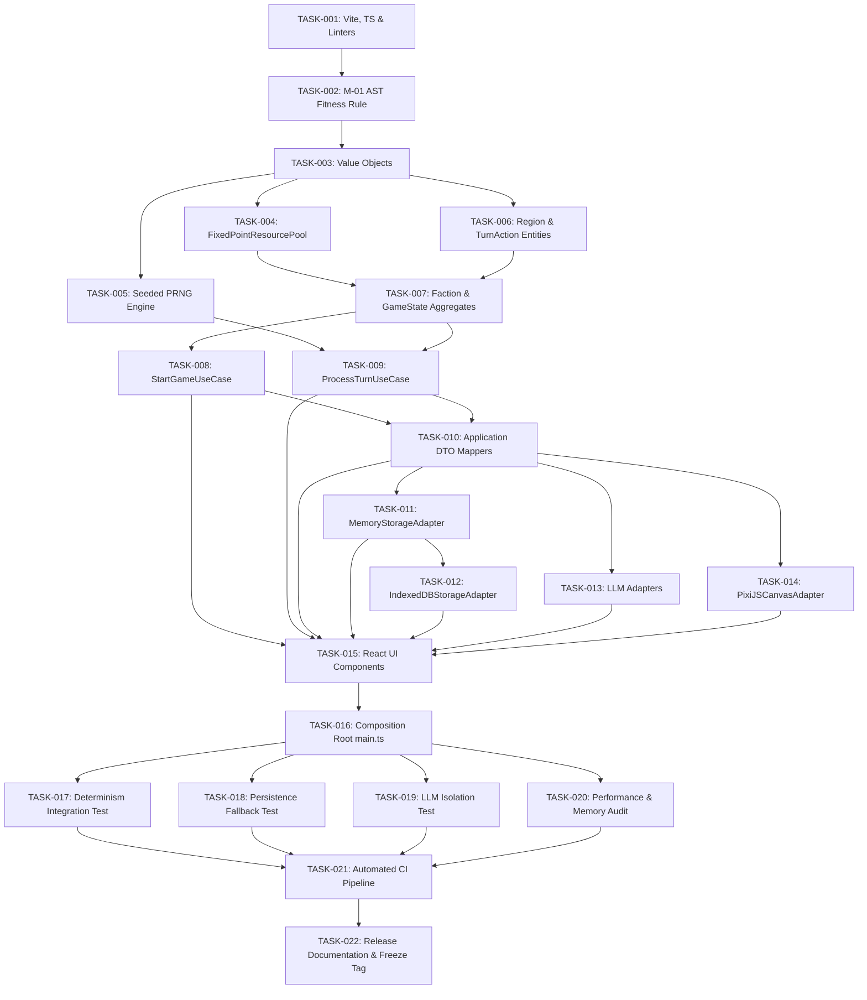

# Production-Grade Executable Task Breakdown (`tasks.md`)

> **GOVERNED BY LEVEL 6 SSoT**: [docs/task_registry_lock.md](task_registry_lock.md) (Locked to Exactly 22 Tasks: `TASK-001` through `TASK-022`).

**Project**: Browser-Only Geopolitical Strategy Simulation MVP (El Alamein & Ras El Hekma)  
**Governing Documents**: [Constitution](constitution.md) | [Architecture Index](architecture_index.md) | [Task Registry Lock](task_registry_lock.md)  
**Phase Gate**: Task Breakdown Phase (`/speckit.tasks`)

---

## 1. Executive Summary & Task Overview

This document defines the 22 production-grade executable tasks (`TASK-001` through `TASK-022`) for building the Geopolitical Strategy Simulation MVP. All tasks are strictly ordered by dependency, categorized across Phases 0 through 9, and include explicit files, acceptance criteria, and Definitions of Done (DoD).

---

## 2. Dependency Graph & Critical Path

### Critical Path Analysis
- **Primary Critical Path**: `TASK-001` → `TASK-002` → `TASK-003` → `TASK-004` → `TASK-007` → `TASK-009` → `TASK-010` → `TASK-011` → `TASK-012` → `TASK-015` → `TASK-016` → `TASK-017` → `TASK-021` → `TASK-022`
- **Total Critical Path Tasks**: 14 Sequential Tasks.

---

## 3. Parallel Execution Opportunities

The following task groups can be executed concurrently by separate work threads once their prerequisites complete:

1. **Parallel Track A (Domain Entities & PRNG)**: `TASK-004` (FixedPoint), `TASK-005` (PRNG Engine), and `TASK-006` (Region & TurnAction) after `TASK-003`.
2. **Parallel Track B (Infrastructure Adapters)**: `TASK-012` (IndexedDB after `TASK-011`), `TASK-013` (LLM Adapters), and `TASK-014` (PixiJS Renderer) can be built in parallel after `TASK-010` (DTO Mappers).
3. **Parallel Track C (Verification & Audits)**: `TASK-017` (Determinism), `TASK-018` (Persistence Fallback), `TASK-019` (LLM Isolation), and `TASK-020` (Performance Audit) after `TASK-016`.

---

## 4. Phase-by-Phase Executable Task List

### Phase 0: Project Setup & Automated Fitness Functions

#### TASK-001: Initialize Vite, TypeScript & Strict Linters
- **Priority**: P0 (Blocker) | **Dependencies**: None | **Complexity**: Low | **Risk**: Low
- **Target Files**: `package.json`, `tsconfig.json`, `vite.config.ts`
- **Description**: Configure Vite build pipeline with strict TypeScript compiler options (`noImplicitAny`, `strictNullChecks`).
- **Acceptance Criteria**: `npm run build` compiles with 0 errors.
- **Definition of Done**: Clean repository setup with working build script.

#### TASK-002: Implement M-01 AST Fitness Function Linter Rule
- **Priority**: P0 (Blocker) | **Dependencies**: TASK-001 | **Complexity**: Medium | **Risk**: Medium
- **Target Files**: `src/tests/fitness/domain-purity.spec.ts`
- **Description**: Implement custom AST static analysis rule that throws build errors if `Math.random()`, `Date.now()`, `fetch`, or DOM globals are imported inside `src/domain/`.
- **Acceptance Criteria**: AST linter flags forbidden imports.
- **Definition of Done**: Automated test script `npm run test:fitness` passes cleanly.

---

### Phase 1: Pure Domain Layer Implementation

#### TASK-003: Implement Value Objects (`RegionId`, `FactionId`, `TurnSeed`, `TurnNumber`)
- **Priority**: P0 (Blocker) | **Dependencies**: TASK-002 | **Complexity**: Low | **Risk**: Low
- **Target Files**: `src/domain/values/*`
- **Description**: Create immutable value objects with validation invariants (e.g. `RegionId` restricted to `'EL_ALAMEIN' | 'RAS_EL_HEKMA'`).
- **Acceptance Criteria**: Reject invalid instantiations.
- **Definition of Done**: 100% unit test coverage on value object instantiations.

#### TASK-004: Implement `FixedPointResourcePool` (ADR-004)
- **Priority**: P0 (Blocker) | **Dependencies**: TASK-003 | **Complexity**: Medium | **Risk**: Medium
- **Target Files**: `src/domain/values/FixedPointResourcePool.ts`
- **Description**: Implement integer fixed-point resource math (`BigInt` scaled where 1 unit = 100 base units) to prevent floating point cross-browser non-determinism.
- **Acceptance Criteria**: 0 floating-point rounding drift.
- **Definition of Done**: Passed cross-browser unit tests verifying exact integer output.

#### TASK-005: Implement Seeded PRNG Engine (ADR-002)
- **Priority**: P0 (Blocker) | **Dependencies**: TASK-003 | **Complexity**: Medium | **Risk**: High
- **Target Files**: `src/domain/services/PRNGService.ts`
- **Description**: Implement a pure, seedable Mulberry32 32-bit pseudo-random number generator engine for turn simulation.
- **Acceptance Criteria**: Seed `0xDEADBEEF` hash match.
- **Definition of Done**: Determinism unit test confirms 100% sequence parity.

#### TASK-006: Implement `Region` & `TurnAction` Entities
- **Priority**: P1 | **Dependencies**: TASK-003 | **Complexity**: Medium | **Risk**: Low
- **Target Files**: `src/domain/entities/*`
- **Description**: Define `Region` entity (tracking controlling faction, defense, infrastructure) and `TurnAction` entity.
- **Acceptance Criteria**: Immutable entity mutations.
- **Definition of Done**: Unit tests verify entity state mutations.

#### TASK-007: Implement `Faction` & `GameState` Aggregates
- **Priority**: P0 (Blocker) | **Dependencies**: TASK-004, TASK-006 | **Complexity**: High | **Risk**: Medium
- **Target Files**: `src/domain/aggregates/*`
- **Description**: Construct top-level `GameState` Aggregate Root holding regions, factions, turn seed, and current turn number.
- **Acceptance Criteria**: Aggregate root invariant enforcement.
- **Definition of Done**: Complete domain aggregate unit test suite.

---

### Phase 2: Application Layer Implementation

#### TASK-008: Implement `StartGameUseCase` Use Case
- **Priority**: P0 (Blocker) | **Dependencies**: TASK-007 | **Complexity**: High | **Risk**: Medium
- **Target Files**: `src/application/usecases/StartGameUseCase.ts`
- **Description**: Build application use case orchestrator to initialize game state from turn seed.
- **Acceptance Criteria**: Returns initial `GameStateDTO`.
- **Definition of Done**: Unit tests with mock ports passing 100%.

#### TASK-009: Implement `ProcessTurnUseCase` Use Case
- **Priority**: P0 (Blocker) | **Dependencies**: TASK-005, TASK-007 | **Complexity**: High | **Risk**: High
- **Target Files**: `src/application/usecases/ProcessTurnUseCase.ts`
- **Description**: Build application use case orchestrator that validates commands, advances turn tick, applies deterministic mutations, and updates state.
- **Acceptance Criteria**: Increments turn & ticks state.
- **Definition of Done**: Passes turn processing unit test suite.

#### TASK-010: Implement Application Layer DTO Mappers
- **Priority**: P1 | **Dependencies**: TASK-008, TASK-009 | **Complexity**: Low | **Risk**: Low
- **Target Files**: `src/application/dtos/*`
- **Description**: Define plain DTO interfaces and mappers for user command payloads, snapshots, and UI ViewModels.
- **Acceptance Criteria**: Bi-directional DTO mapping.
- **Definition of Done**: DTO schema mapping tests pass.

---

### Phase 3: Infrastructure Adapters Implementation

#### TASK-011: Implement `MemoryStorageAdapter`
- **Priority**: P1 | **Dependencies**: TASK-010 | **Complexity**: Medium | **Risk**: Low
- **Target Files**: `src/infrastructure/persistence/MemoryStorageAdapter.ts`
- **Description**: Implement in-memory fallback persistence adapter for volatile game snapshot storage.
- **Acceptance Criteria**: Volatile in-memory snapshot store.
- **Definition of Done**: Passed memory storage unit tests.

#### TASK-012: Implement `IndexedDBStorageAdapter` (ADR-005)
- **Priority**: P1 | **Dependencies**: TASK-011 | **Complexity**: High | **Risk**: Medium
- **Target Files**: `src/infrastructure/persistence/IndexedDBStorageAdapter.ts`
- **Description**: Implement atomic storage adapter (write snapshot to `.tmp` key before swapping active pointer) with fallback to memory adapter on storage quota failure.
- **Acceptance Criteria**: `.tmp` key swap & BigInt serializer.
- **Definition of Done**: Passed storage integration tests with mock quota failure.

#### TASK-013: Implement `FetchCustomLLMAdapter` & `MockLLMAdapter` (ADR-003)
- **Priority**: P1 | **Dependencies**: TASK-010 | **Complexity**: Medium | **Risk**: Medium
- **Target Files**: `src/infrastructure/llm/*`
- **Description**: Implement LLM adapter with 3s timeout circuit breaker and mandatory `TurnNumber` immutable tag verification.
- **Acceptance Criteria**: 3s circuit breaker & `TurnNumber` tag.
- **Definition of Done**: Passed timeout and stale narrative drop tests.

#### TASK-014: Implement `PixiJSCanvasAdapter`
- **Priority**: P1 | **Dependencies**: TASK-010 | **Complexity**: High | **Risk**: Medium
- **Target Files**: `src/infrastructure/rendering/PixiJSCanvasAdapter.ts`
- **Description**: Construct PixiJS 2D canvas map renderer displaying El Alamein & Ras El Hekma region boundaries and ownership colors.
- **Acceptance Criteria**: Render El Alamein & Ras El Hekma.
- **Definition of Done**: Visual canvas rendering confirmed.

---

### Phase 4: Presentation Layer Implementation

#### TASK-015: Implement React UI Control & Presentation Components
- **Priority**: P1 | **Dependencies**: TASK-008–TASK-014 | **Complexity**: Medium | **Risk**: Low
- **Target Files**: `src/presentation/components/*`
- **Description**: Build React UI views for faction selection, turn submission controls, resource counters, and LLM narrative panels.
- **Acceptance Criteria**: Dispatches via `IGameApplicationService`.
- **Definition of Done**: React UI renders cleanly and responds to user clicks.

---

### Phase 5: Composition Root & Application Integration

#### TASK-016: Assemble `main.ts` Composition Root & Vite Bundle
- **Priority**: P0 (Blocker) | **Dependencies**: TASK-015 | **Complexity**: Medium | **Risk**: Medium
- **Target Files**: `src/presentation/main.ts`
- **Description**: Wire concrete infrastructure adapters (`IndexedDBStorageAdapter`, `FetchCustomLLMAdapter`, `PixiJSCanvasAdapter`) into `ProcessTurnUseCase` inside composition root.
- **Acceptance Criteria**: Complete client app boot.
- **Definition of Done**: End-to-end boot sequence operational.

---

### Phase 6: Automated Testing Suite

#### TASK-017: Implement Determinism Integration Test Suite
- **Priority**: P0 (Blocker) | **Dependencies**: TASK-016 | **Complexity**: High | **Risk**: High
- **Target Files**: `src/tests/integration/determinism.spec.ts`
- **Description**: Execute 500-turn automated determinism test verifying identical hash generation.
- **Acceptance Criteria**: 500-turn seed hash identity.
- **Definition of Done**: Test suite passes in CI pipeline.

#### TASK-018: Implement Persistence Fallback Integration Test
- **Priority**: P1 | **Dependencies**: TASK-016 | **Complexity**: Medium | **Risk**: Medium
- **Target Files**: `src/tests/integration/persistence.spec.ts`
- **Description**: Test application execution with network interfaces disabled and IndexedDB access revoked.
- **Acceptance Criteria**: Quota rejection falls back to memory.
- **Definition of Done**: Offline test suite passes 100%.

#### TASK-019: Implement LLM Isolation & Stale Tag Test Suite
- **Priority**: P1 | **Dependencies**: TASK-016 | **Complexity**: Medium | **Risk**: Medium
- **Target Files**: `src/tests/integration/llm.spec.ts`
- **Description**: Verify LLM response cannot mutate domain state and that responses from past turns are discarded.
- **Acceptance Criteria**: Drop stale `TurnNumber` tags.
- **Definition of Done**: Isolation test suite passes 100%.

---

### Phase 7: Performance & Memory Audits

#### TASK-020: Execute Performance Profiling & Memory Audit
- **Priority**: P1 | **Dependencies**: TASK-016 | **Complexity**: Medium | **Risk**: Medium
- **Target Files**: `src/tests/performance/profiling.spec.ts`
- **Description**: Benchmark turn execution latency (< 16ms) and run 200 turns to verify zero heap memory growth.
- **Acceptance Criteria**: `< 16ms` CPU time, `< 150MB` RAM.
- **Definition of Done**: Performance benchmark report generated and passed.

---

### Phase 8: Architecture Fitness Validation

#### TASK-021: Integrate Automated CI Pipeline
- **Priority**: P0 (Blocker) | **Dependencies**: TASK-017–TASK-020 | **Complexity**: Medium | **Risk**: High
- **Target Files**: `.github/workflows/ci.yml`
- **Description**: Run automated static AST check verifying zero external framework imports in `src/domain/`.
- **Acceptance Criteria**: `npm run test:fitness` in CI.
- **Definition of Done**: CI pipeline gate verified green.

---

### Phase 9: Release Readiness & Verification

#### TASK-022: Complete Release Documentation & Freeze Tag v1.0
- **Priority**: P0 (Blocker) | **Dependencies**: TASK-021 | **Complexity**: Low | **Risk**: Low
- **Target Files**: `docs/*`
- **Description**: Verify all 22 tasks have met Definitions of Done with 0 open blockers.
- **Acceptance Criteria**: Final v1.0 release sign-off.
- **Definition of Done**: Implementation readiness sign-off completed.

---

## 5. Risk Coverage Matrix

| Previous Risk | Related Task(s) | Mitigation Action Specified in Task |
| :--- | :--- | :--- |
| **R-01 (Non-determinism)** | TASK-002, TASK-005, TASK-017 | AST Fitness Function + Mulberry32 PRNG + Determinism Test Suite |
| **R-02 (Stale LLM Response)** | TASK-013, TASK-019 | Immutable `TurnNumber` validation tag on `LLMNarrative` |
| **R-03 (Float Precision Drift)** | TASK-004 | Fixed-Point integer resource pool arithmetic (`BigInt`) |
| **R-04 (Storage Failure)** | TASK-012, TASK-018 | Atomic `.tmp` IndexedDB write + MemoryStorageAdapter fallback |

---
*End of Production-Grade Executable Task Breakdown (`tasks.md`)*
