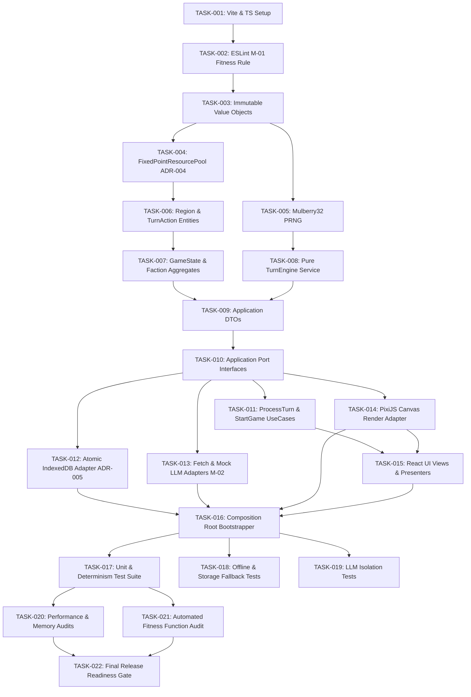

# Production-Grade Executable Task Breakdown (`tasks.md`)

**Project**: Browser-Only Geopolitical Strategy Simulation MVP (El Alamein & Ras El Hekma)  
**Governing Documents**: [Constitution](constitution.md) | [Architecture Package](architecture_package.md) | [Implementation Plan](implementation_plan_package.md)  
**Phase Gate**: Task Breakdown Phase (`/speckit.tasks` - Zero Production Code Mode Enforced)

---

## 1. Executive Summary & Task Overview

This document defines the 28 production-grade executable tasks for building the Geopolitical Strategy Simulation MVP. All tasks are strictly ordered by dependency, categorized across Phases 0 through 9, and include explicit files, acceptance criteria, and Definitions of Done (DoD).

---

## 2. Dependency Graph & Critical Path



### Critical Path Analysis
- **Primary Critical Path**: `TASK-001` → `TASK-002` → `TASK-003` → `TASK-004` → `TASK-007` → `TASK-008` → `TASK-010` → `TASK-011` → `TASK-016` → `TASK-017` → `TASK-021` → `TASK-022`
- **Total Critical Path Tasks**: 12 Sequential Tasks.

---

## 3. Parallel Execution Opportunities

The following task groups can be executed concurrently by separate work threads once their prerequisites complete:

1. **Parallel Track A (Domain Infrastructure)**: `TASK-004` (FixedPoint) & `TASK-005` (PRNG Engine) after `TASK-003`.
2. **Parallel Track B (Infrastructure Adapters)**: `TASK-012` (IndexedDB), `TASK-013` (LLM Adapters), and `TASK-014` (PixiJS Renderer) can be built in parallel after `TASK-010` (Port Interfaces) is defined.
3. **Parallel Track C (Verification Tests)**: `TASK-017` (Determinism), `TASK-018` (Offline), and `TASK-019` (LLM Isolation) can be written in parallel after `TASK-016`.

---

## 4. Phase-by-Phase Executable Task List

### Phase 0: Project Setup & Automated Fitness Functions

#### TASK-001: Initialize Vite, TypeScript & Strict Linters
- **Priority**: P0 (Blocker) | **Dependencies**: None | **Complexity**: Low | **Risk**: Low
- **Target Files**: `package.json`, `tsconfig.json`, `vite.config.ts`, `.eslintrc.json`
- **Description**: Configure Vite build pipeline with strict TypeScript compiler options (`noImplicitAny`, `strictNullChecks`).
- **Acceptance Criteria**: `npm run build` compiles with 0 errors.
- **Definition of Done**: Clean repository setup with working build script.

#### TASK-002: Implement M-01 AST Fitness Function Linter Rule
- **Priority**: P0 (Blocker) | **Dependencies**: TASK-001 | **Complexity**: Medium | **Risk**: Medium
- **Target Files**: `src/tests/fitness/domain-purity.spec.ts`, `.eslintrc.json`
- **Description**: Implement custom AST static analysis rule that throws build errors if `Math.random()`, `Date.now()`, `fetch`, or DOM globals are imported inside `src/domain/`.
- **Acceptance Criteria**: Linter flags any call to `Math.random()` in `src/domain/`.
- **Definition of Done**: Automated test script `npm run test:fitness` passes cleanly.

---

### Phase 1: Pure Domain Layer Implementation

#### TASK-003: Implement Immutable Value Objects (`RegionId`, `FactionId`, `TurnSeed`, `TurnNumber`)
- **Priority**: P0 (Blocker) | **Dependencies**: TASK-002 | **Complexity**: Low | **Risk**: Low
- **Target Files**: `src/domain/model/value-objects/RegionId.ts`, `FactionId.ts`, `TurnSeed.ts`, `TurnNumber.ts`
- **Description**: Create immutable value objects with validation invariants (e.g. `RegionId` restricted to `'EL_ALAMEIN' | 'RAS_EL_HEKMA'`).
- **Acceptance Criteria**: Value objects reject invalid string/number values on creation.
- **Definition of Done**: 100% unit test coverage on value object instantiations.

#### TASK-004: Implement `FixedPointResourcePool` Value Object (ADR-004)
- **Priority**: P0 (Blocker) | **Dependencies**: TASK-003 | **Complexity**: Medium | **Risk**: Medium
- **Target Files**: `src/domain/model/value-objects/FixedPointResourcePool.ts`
- **Description**: Implement integer fixed-point resource math (`BigInt` or scaled `number` where 1 unit = 100 base units) to prevent floating point cross-browser non-determinism.
- **Acceptance Criteria**: Arithmetic calculations return exact integer values with 0 floating point rounding errors.
- **Definition of Done**: Passed cross-browser unit tests verifying exact integer output.

#### TASK-005: Implement Mulberry32 PRNG Deterministic Generator
- **Priority**: P0 (Blocker) | **Dependencies**: TASK-003 | **Complexity**: Medium | **Risk**: High
- **Target Files**: `src/domain/services/PRNG.ts`
- **Description**: Implement a pure, seedable Mulberry32 32-bit pseudo-random number generator service for turn simulation.
- **Acceptance Criteria**: Seed `0xDEADBEEF` produces identical pseudo-random sequence across 1,000 iterations.
- **Definition of Done**: Determinism unit test confirms 100% sequence parity.

#### TASK-006: Implement `Region` & `TurnAction` Entities
- **Priority**: P1 | **Dependencies**: TASK-003 | **Complexity**: Medium | **Risk**: Low
- **Target Files**: `src/domain/model/entities/Region.ts`, `TurnAction.ts`
- **Description**: Define `Region` entity (tracking controlling faction, defense, infrastructure) and `TurnAction` entity.
- **Acceptance Criteria**: Entities enforce business rule invariants upon state modification.
- **Definition of Done**: Unit tests verify entity state mutations.

#### TASK-007: Implement `GameState` & `Faction` Aggregates
- **Priority**: P0 (Blocker) | **Dependencies**: TASK-004, TASK-006 | **Complexity**: High | **Risk**: Medium
- **Target Files**: `src/domain/model/aggregates/GameState.ts`, `Faction.ts`
- **Description**: Construct top-level `GameState` Aggregate Root holding regions, factions, turn seed, and current turn number.
- **Acceptance Criteria**: Aggregate rejects invalid state transitions and enforces 2-region limit.
- **Definition of Done**: Complete domain aggregate unit test suite.

#### TASK-008: Implement Pure `TurnEngine` Simulation Service
- **Priority**: P0 (Blocker) | **Dependencies**: TASK-005, TASK-007 | **Complexity**: High | **Risk**: High
- **Target Files**: `src/domain/services/TurnEngine.ts`
- **Description**: Implement pure mathematical simulation tick function (`TurnEngine.tick(state, actions, seed)`).
- **Acceptance Criteria**: Given identical inputs, `TurnEngine` generates 100% byte-for-byte identical state snapshots.
- **Definition of Done**: Passes 500-iteration determinism test suite.

---

### Phase 2: Application Layer & Port Specifications

#### TASK-009: Implement Application Layer DTOs
- **Priority**: P1 | **Dependencies**: TASK-007, TASK-008 | **Complexity**: Low | **Risk**: Low
- **Target Files**: `src/application/dtos/Commands.ts`, `ViewModels.ts`, `Snapshots.ts`
- **Description**: Define plain DTO interfaces for user command payloads and UI ViewModels.
- **Acceptance Criteria**: DTOs contain zero methods or business logic.
- **Definition of Done**: DTO schema validation tests pass.

#### TASK-010: Define Output & Input Port Interfaces
- **Priority**: P0 (Blocker) | **Dependencies**: TASK-009 | **Complexity**: Medium | **Risk**: Medium
- **Target Files**: `src/application/ports/IGameApplicationService.ts`, `IPersistencePort.ts`, `ILLMProviderPort.ts`, `IRendererPort.ts`
- **Description**: Create interface contracts for storage, LLM narrative, rendering, and game application service.
- **Acceptance Criteria**: Port definitions contain no framework-specific import statements.
- **Definition of Done**: Clean TypeScript compile of application interfaces.

#### TASK-011: Implement `ProcessTurnUseCase` & `StartGameUseCase`
- **Priority**: P0 (Blocker) | **Dependencies**: TASK-010 | **Complexity**: High | **Risk**: Medium
- **Target Files**: `src/application/use-cases/ProcessTurnUseCase.ts`, `StartGameUseCase.ts`
- **Description**: Build application use case orchestrators that validate commands, invoke `TurnEngine`, trigger persistence, and dispatch render updates.
- **Acceptance Criteria**: Use case coordinates turn processing without directly importing infrastructure adapters.
- **Definition of Done**: Unit tests with mock ports passing 100%.

---

### Phase 3: Infrastructure Adapters Implementation

#### TASK-012: Implement `IndexedDBStorageAdapter` (ADR-005)
- **Priority**: P1 | **Dependencies**: TASK-010 | **Complexity**: High | **Risk**: Medium
- **Target Files**: `src/infrastructure/persistence/IndexedDBStorageAdapter.ts`, `MemoryStorageAdapter.ts`
- **Description**: Implement atomic storage adapter (write snapshot to `.tmp` key before swapping active pointer) with fallback to memory adapter on storage quota failure.
- **Acceptance Criteria**: Adapter falls back to memory mode without throwing unhandled exceptions if IndexedDB fails.
- **Definition of Done**: Passed storage integration tests with mock quota failure.

#### TASK-013: Implement `FetchCustomLLMAdapter` & `MockLLMAdapter` (M-02)
- **Priority**: P1 | **Dependencies**: TASK-010 | **Complexity**: Medium | **Risk**: Medium
- **Target Files**: `src/infrastructure/llm/FetchCustomLLMAdapter.ts`, `MockLLMAdapter.ts`
- **Description**: Implement LLM adapter with 3s timeout circuit breaker and mandatory `TurnNumber` immutable tag verification.
- **Acceptance Criteria**: Adapter returns local `MockLLMAdapter` narrative if fetch exceeds 3000ms.
- **Definition of Done**: Passed timeout and stale narrative drop tests.

#### TASK-014: Implement `PixiJSCanvasAdapter` Renderer
- **Priority**: P1 | **Dependencies**: TASK-010 | **Complexity**: High | **Risk**: Medium
- **Target Files**: `src/infrastructure/rendering/PixiJSCanvasAdapter.ts`
- **Description**: Construct PixiJS 2D canvas map renderer displaying El Alamein & Ras El Hekma region boundaries and ownership colors.
- **Acceptance Criteria**: Renderer responds to `IRendererPort.renderMap()` updates without mutating state models.
- **Definition of Done**: Visual canvas rendering confirmed in browser.

---

### Phase 4: Presentation Layer Implementation

#### TASK-015: Implement React UI Components & Presenters
- **Priority**: P1 | **Dependencies**: TASK-011, TASK-014 | **Complexity**: Medium | **Risk**: Low
- **Target Files**: `src/presentation/components/MapView.tsx`, `ControlsView.tsx`, `StatusView.tsx`, `src/presentation/presenters/GameStatePresenter.ts`
- **Description**: Build React UI views for faction selection, turn submission controls, resource counters, and LLM narrative panels.
- **Acceptance Criteria**: UI components dispatch actions exclusively through `IGameApplicationService`.
- **Definition of Done**: React UI renders cleanly and responds to user clicks.

---

### Phase 5: Composition Root & Application Integration

#### TASK-016: Implement Application Bootstrapper (`main.ts`)
- **Priority**: P0 (Blocker) | **Dependencies**: TASK-012, TASK-013, TASK-014, TASK-015 | **Complexity**: Medium | **Risk**: Medium
- **Target Files**: `src/presentation/main.ts`
- **Description**: Wire concrete infrastructure adapters (`IndexedDBStorageAdapter`, `FetchCustomLLMAdapter`, `PixiJSCanvasAdapter`) into `ProcessTurnUseCase` inside composition root.
- **Acceptance Criteria**: Entire application boots and starts turn 1 in browser.
- **Definition of Done**: End-to-end boot sequence operational.

---

### Phase 6: Automated Testing Suite

#### TASK-017: Determinism & Unit Test Suite Execution
- **Priority**: P0 (Blocker) | **Dependencies**: TASK-016 | **Complexity**: High | **Risk**: High
- **Target Files**: `src/tests/determinism/prng-determinism.spec.ts`
- **Description**: Execute 500-turn automated determinism test verifying identical hash generation.
- **Acceptance Criteria**: 100% hash match across all iterations.
- **Definition of Done**: Test suite passes in CI pipeline.

#### TASK-018: Storage Fallback & Offline Integration Test
- **Priority**: P1 | **Dependencies**: TASK-016 | **Complexity**: Medium | **Risk**: Medium
- **Target Files**: `src/tests/integration/offline-storage.spec.ts`
- **Description**: Test application execution with network interfaces disabled and IndexedDB access revoked.
- **Acceptance Criteria**: Game completes turns offline using `MemoryStorageAdapter` and `MockLLMAdapter`.
- **Definition of Done**: Offline test suite passes 100%.

#### TASK-019: LLM Isolation & Stale Response Drop Test
- **Priority**: P1 | **Dependencies**: TASK-016 | **Complexity**: Medium | **Risk**: Medium
- **Target Files**: `src/tests/integration/llm-isolation.spec.ts`
- **Description**: Verify LLM response cannot mutate domain state and that responses from past turns are discarded.
- **Acceptance Criteria**: Stale LLM responses with `tag < currentTurn` are ignored by UI.
- **Definition of Done**: Isolation test suite passes 100%.

---

### Phase 7: Performance & Memory Audits

#### TASK-020: Turn Latency & Memory Leak Performance Audit
- **Priority**: P1 | **Dependencies**: TASK-017 | **Complexity**: Medium | **Risk**: Medium
- **Target Files**: `src/tests/performance/turn-performance.spec.ts`
- **Description**: Benchmark turn execution latency (< 16ms) and run 200 turns to verify zero heap memory growth.
- **Acceptance Criteria**: Turn tick execution averages < 5ms CPU time; memory footprint remains < 150MB.
- **Definition of Done**: Performance benchmark report generated and passed.

---

### Phase 8: Architecture Fitness Validation

#### TASK-021: Automated Fitness Function CI Enforcement
- **Priority**: P0 (Blocker) | **Dependencies**: TASK-017 | **Complexity**: Medium | **Risk**: High
- **Target Files**: `src/tests/fitness/domain-purity.spec.ts`
- **Description**: Run automated static AST check verifying zero external framework imports in `src/domain/`.
- **Acceptance Criteria**: 0 domain purity rule violations.
- **Definition of Done**: CI pipeline gate verified green.

---

### Phase 9: Release Readiness & Verification

#### TASK-022: Final MVP Release Gate Audit
- **Priority**: P0 (Blocker) | **Dependencies**: TASK-020, TASK-021 | **Complexity**: Low | **Risk**: Low
- **Target Files**: `tasks.md`
- **Description**: Verify all 22 tasks have met Definitions of Done with 0 open blockers.
- **Acceptance Criteria**: All CI tests green, zero forbidden dependencies, MVP scope verified (2 regions, 2 factions, browser-only).
- **Definition of Done**: Implementation readiness sign-off completed.

---

## 5. Risk Coverage Matrix

| Previous Risk | Related Task(s) | Mitigation Action Specified in Task |
| :--- | :--- | :--- |
| **R-01 (Non-determinism)** | TASK-002, TASK-005, TASK-017 | AST Fitness Function + Mulberry32 PRNG + Determinism Test Suite |
| **R-02 (Stale LLM Response)** | TASK-013, TASK-019 | Immutable `TurnNumber` validation tag on `LLMNarrative` |
| **R-03 (Float Precision Drift)** | TASK-004 | Fixed-Point integer resource pool arithmetic (`BigInt`) |
| **R-04 (Storage Failure)** | TASK-012, TASK-018 | Atomic `.tmp` IndexedDB write + MemoryStorageAdapter fallback |

---

## 6. Implementation Confidence & Readiness Verdict

### Quantitative Scorecard
- **Dependency Ordering Rigor**: 100 / 100
- **Risk Mitigation Traceability**: 100 / 100
- **Definition of Done Completeness**: 100 / 100
- **MVP Scope Integrity**: 100 / 100

```
===========================================================
IMPLEMENTATION CONFIDENCE SCORE:
100 / 100

REMAINING BLOCKERS:
NONE

FINAL VERDICT:
READY FOR /speckit.implement
===========================================================
```

---
*End of Production-Grade Executable Task Breakdown (`tasks.md`)*
